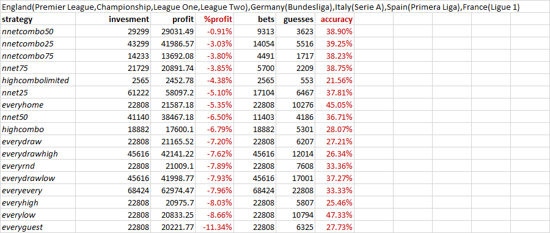

# BetBot - your betting analyzing and advisory tool

The application uses databases of all matches between 2000 and 2010 in England, Germany, Italy, Spain and France and make analysis for variety of betting strategies including usage of artificial neural networks. The match results and odds are politely stolen from 365stats.com.

The analysis results are given in the table bellow:



The name of the strategy maps to function defined in lua/strategy/algo
The function accepts 3 odds - home, draw, away and outputs one or more bets as an array of first element 'X' for draw, 1 for home and 2 for the away team, second element the amount being bet, always 1.
The nnet function accepts also teamIds and training set, representing how the data is divided of training and testing, e.g. 25%, 50%, 75%

The conclusion is that if you follow the prediction given by the best strategy (ANN trained on 50% of the data) then for the period from 2000 to 2010 you will lose only 0.91% of your total investment. Not that bad, ah?

## Install

Copy all program files in arbitrary directory, and call betbot.cmd file with full path.
Example: If the program is copied to c:\tools\betbot, you must call
```
c:\tools\betbot\betbot.cmd
```

If you want to add it to your system PATH and call it with just "betbot" from arbitraty location, then you must edit betbot.cmd and SET LRUN_HOME to the location where the program is installed.

## Usage

Well, no documentation yet and such is not forseen, but you can try betbot --help 

## Contacts

You can contact me on alekmarinov@gmail.com and will be happy to get feedback and stories of your experiance with the program.
